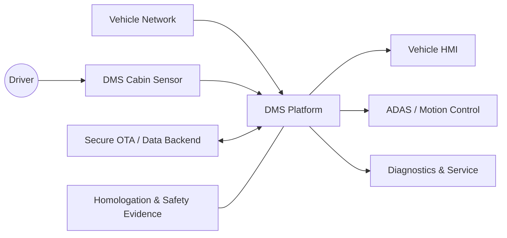

# BDD — DMS System Context

```mermaid
flowchart LR
 Driver((Driver)) --> Cabin[DMS Cabin Sensor]
 Vehicle[Vehicle Network] --> DMS[DMS Platform]
 Cabin --> DMS
 DMS --> HMI[Vehicle HMI]
 DMS --> ADAS[ADAS / Motion Control]
 DMS --> Diag[Diagnostics & Service]
 Backend[Secure OTA / Data Backend] <--> DMS
 Hom[Homologation & Safety Evidence] --- DMS
```
