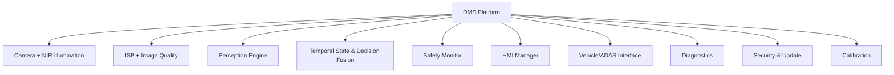

# BDD — Platform Decomposition

```mermaid
flowchart TB
 DMS[DMS Platform]
 DMS --> SENS[Camera + NIR Illumination]
 DMS --> ISP[ISP + Image Quality]
 DMS --> PER[Perception Engine]
 DMS --> FUS[Temporal State & Decision Fusion]
 DMS --> SAFE[Safety Monitor]
 DMS --> HMI[HMI Manager]
 DMS --> IF[Vehicle/ADAS Interface]
 DMS --> DIAG[Diagnostics]
 DMS --> SEC[Security & Update]
 DMS --> CAL[Calibration]
```
