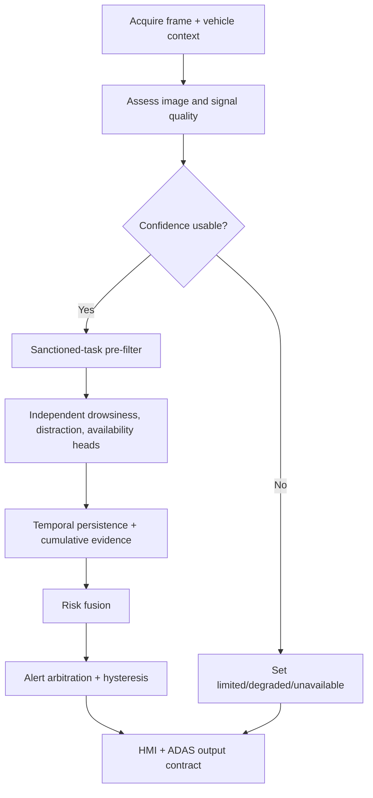

# Activity — Driver-State Decision

```mermaid
flowchart TD
 A[Acquire frame + vehicle context] --> B[Assess image and signal quality]
 B --> C{Confidence usable?}
 C -- No --> D[Set limited/degraded/unavailable]
 C -- Yes --> E[Sanctioned-task pre-filter]
 E --> F[Independent drowsiness, distraction, availability heads]
 F --> G[Temporal persistence + cumulative evidence]
 G --> H[Risk fusion]
 H --> I[Alert arbitration + hysteresis]
 I --> J[HMI + ADAS output contract]
 D --> J
```
