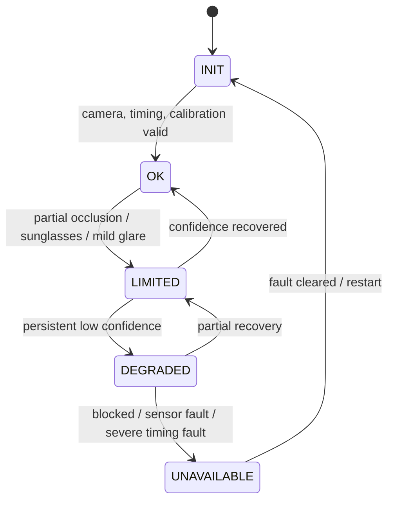

# State Machine — DMS Availability

```mermaid
stateDiagram-v2
 [*] --> INIT
 INIT --> OK: camera, timing, calibration valid
 OK --> LIMITED: partial occlusion / sunglasses / mild glare
 LIMITED --> OK: confidence recovered
 LIMITED --> DEGRADED: persistent low confidence
 DEGRADED --> LIMITED: partial recovery
 DEGRADED --> UNAVAILABLE: blocked / sensor fault / severe timing fault
 UNAVAILABLE --> INIT: fault cleared / restart
```
