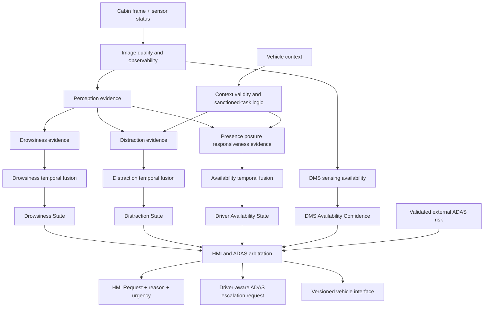

# Normalized Driver-State Decision Architecture

This architecture is the system-requirements interpretation of the live scenario matrix.

## Architectural rules

1. Drowsiness, distraction, driver availability and DMS sensing availability are independent outputs.
2. `DEGRADED/UNAVAILABLE` is not part of behavioral severity.
3. Sanctioned-task classification uses valid vehicle context before distraction arbitration.
4. Temporal fusion precedes warning escalation.
5. Low observability produces `UNKNOWN/UNCONFIRMED`, not a confident normal state.
6. External ADAS risk is validated before fusion.
7. DMS may request escalation but does not independently command vehicle motion.
8. HMI arbitration preserves mandatory regulatory behavior over optional OEM coaching.
