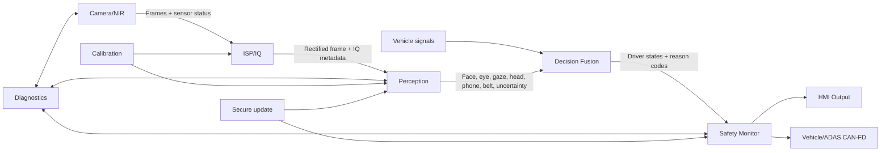

# IBD — Internal Interfaces

```mermaid
flowchart LR
 CAM[Camera/NIR] -->|Frames + sensor status| ISP[ISP/IQ]
 ISP -->|Rectified frame + IQ metadata| PER[Perception]
 VEH[Vehicle signals] --> FUS[Decision Fusion]
 PER -->|Face, eye, gaze, head, phone, belt, uncertainty| FUS
 FUS -->|Driver states + reason codes| SAFE[Safety Monitor]
 SAFE --> HMI[HMI Output]
 SAFE --> CAN[Vehicle/ADAS CAN-FD]
 DIAG[Diagnostics] <--> CAM
 DIAG <--> PER
 DIAG <--> SAFE
 CAL[Calibration] --> ISP
 CAL --> PER
 SEC[Secure update] --> PER
 SEC --> SAFE
```
