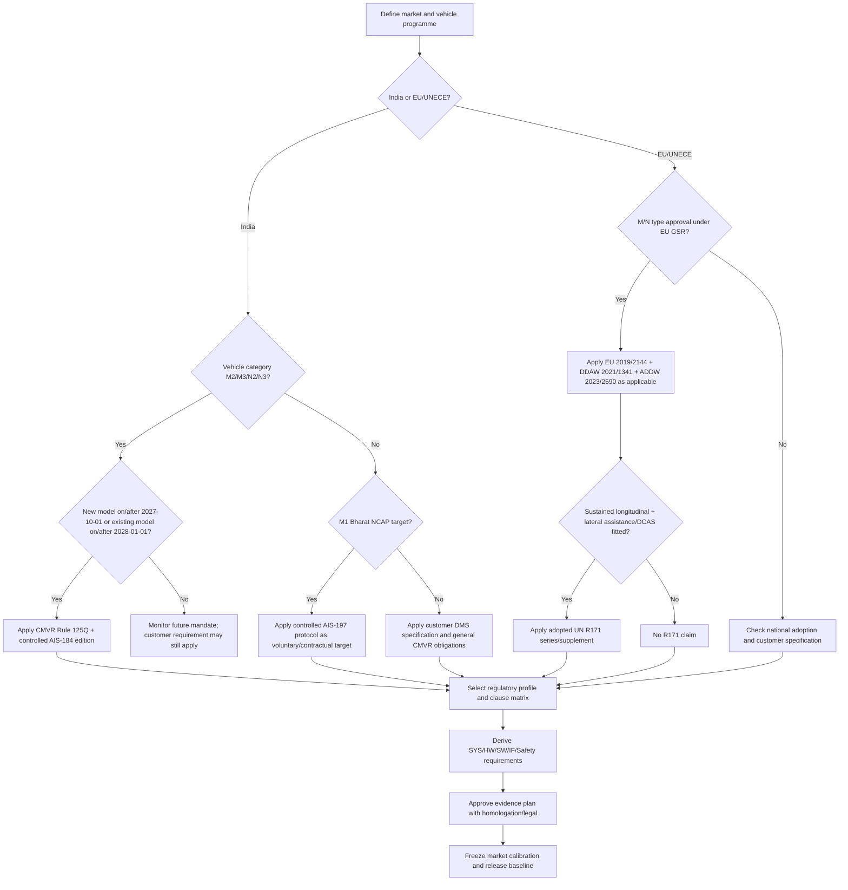

# Regulatory Applicability Decision Tree

## Decision record attributes

| Attribute | Required content |
|---|---|
| Programme ID | vehicle platform/model/variant |
| Market | country/type-approval territory |
| Vehicle category | M1/M2/M3/N1/N2/N3 etc. |
| Model status | new type/new model/existing model |
| SOP and type-approval dates | exact calendar dates |
| Feature set | DDAW, ADDW, DCAS, AEBS, LDWS, fleet features |
| Regulation edition | regulation/AIS series, supplement and amendment |
| Applicability status | mandatory now/future, voluntary, feature-triggered, contractual, N/A |
| Interpretation owner | homologation/legal/system/safety |
| Evidence owner | responsible function/team |
| Open points | ambiguity, exemption, pending amendment, technical-service decision |
| Approval | named approvers and date |
